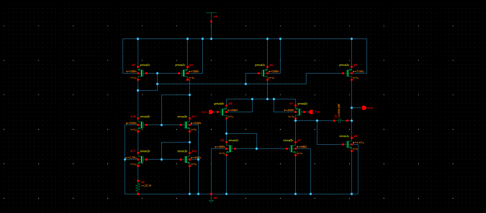
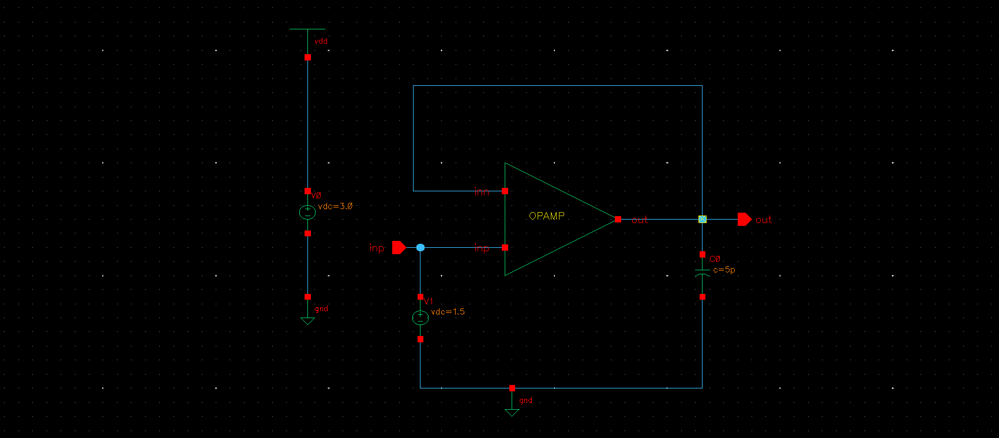
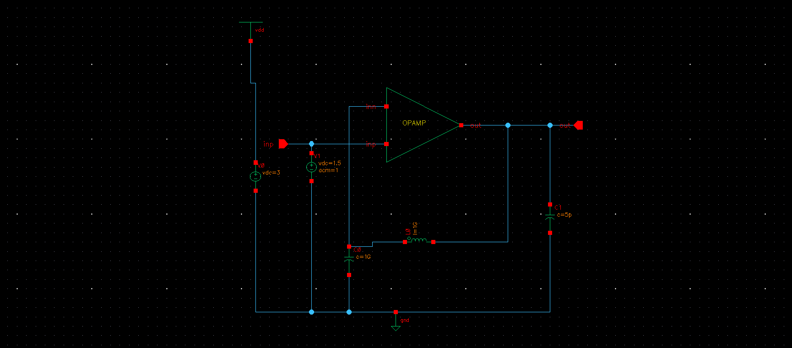

# OPAMP-design-project
Design project of a two stage CMOS operational amplifier. Component values was first calculated by hand and correct operation
of the amplifier was verified with different simulations using testbenches. The work was done by Cadence circuit design program. Group project (2 people) for electronic design 2 -course

## OPAMP Specifications and Results

| Parameter | Symbol | Target Specification | Result |
| :--- | :---: | :--- | :--- |
| **DC Voltage Gain** | $A_v$ | > 1000 | 1259 |
| **Unity Gain Frequency** | $f_t$ |  5 MHz (Miller) | 4 MHz |
| **Slew Rate** | SR |  4 V/μs | 3.85 |
| **Supply Voltage** | $V_{dd}$ | 3 V (GND = 0 V) | 3V |
| **Common-Mode Input Range** | ICMR | 0.2 V – 2.1 V | 0.272 V - 2.21 V |
| **Output Voltage Range** | $V_{out}$ | 0.2 V – 2.7 V | 0.437 V - 2.64 V |
| **Phase Margin** | PM | 55° (Miller)  | 59 |

## Schematics

### OPAMP

### Testbench for DC-simulations

### Testbench for AC-simulations

